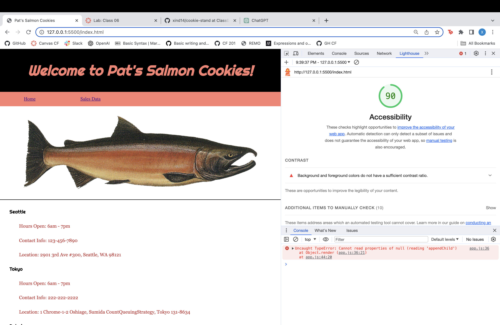
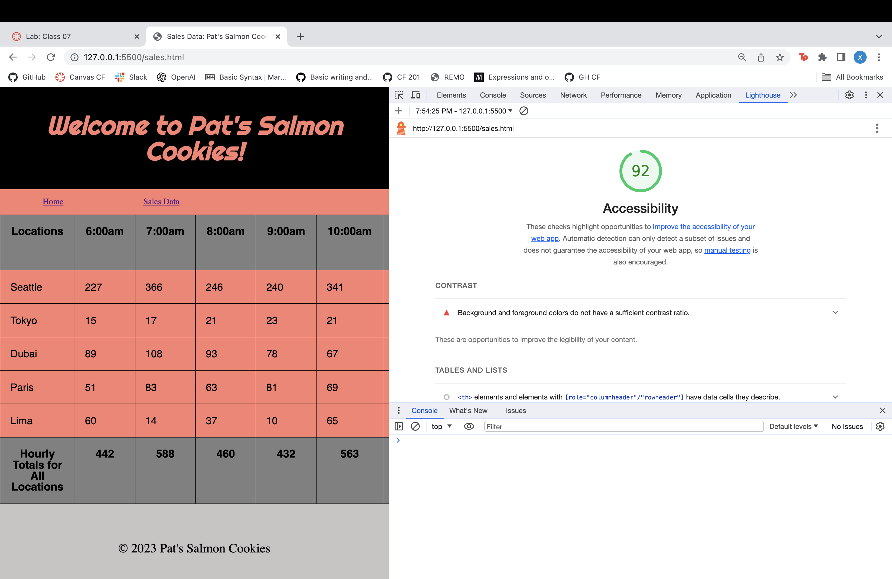
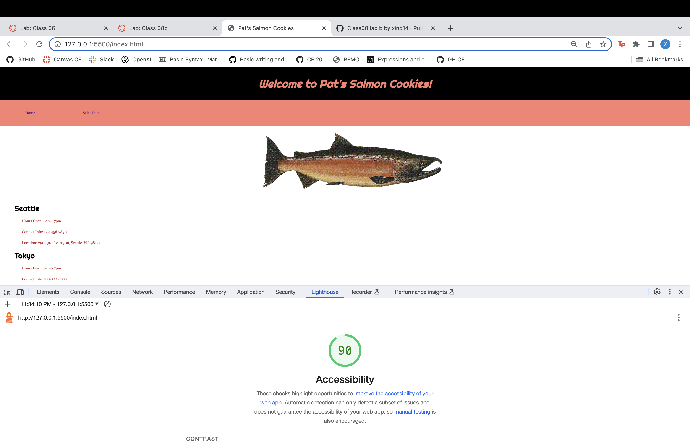

# Lab 6, 7, 8, 9, 10 Salmon Cookies

## Salmon Cookies Pt.1 Objects

### Author: Xin Deng

### Links and Resources

1. [Setting Up a New Code 201 Project](https://codefellows.github.io/code-201-guide/curriculum/class-02/project-setup)

### Lighthouse Accessibility Report Score

### Reflections and Comments

1. How did this go, overall?

  - There was a lot for this lab, a lot of new things I was unsure about and I did struggle. But I really wanted to go slower and ask gpt what certain lines mean. I want to be able to understand the concepts that was taught. 
  

2. What observations or questions do you have about what you’ve learned so far?

 - My code is really long. I don't know how to make it short. Someone at my remo table just made one function for everything and I wish I could understand to do that. 

3. How long did it take you to complete this assignment? And, before you started, how long did you think it would take you to complete this assignment?
 
- It took me 7 hours to do this assignment. I knew it was gonna take me a long time to do it, because I'm still not quite sure or confident I understand objects yet. 

## Salmon Cookies Pt.2 Constructors

### Author: Xin Deng

### Links and Resources

1. [Setting Up a New Code 201 Project](https://codefellows.github.io/code-201-guide/curriculum/class-02/project-setup)

### Lighthouse Accessibility Report Score

### Reflections and Comments

1. How did this go, overall?

 - It was hard. I had a hard time keeping track of all the variable names I had made so I really confused myself a lot. I was trying to do the stretch goals but I ended up messing up the original assignment goals so that took awhile to fix. 
  
2. What observations or questions do you have about what you’ve learned so far?

- I really like playing around in CSS now, but I don't think some of the things we had to do in JS was necessary and felt like we could just add them into HTML. Like the stores hours, phone, and address.

3. How long did it take you to complete this assignment? And, before you started, how long did you think it would take you to complete this assignment?
 
- It took me 7 hours to do this assignment again. I knew it was going to take me a long time because we had to make the code dry using a new concept and make a table which is another concept. 

## Salmon Cookies Pt.3 Finishing up Home page

### Author: Xin Deng

### Links and Resources

1. [Setting Up a New Code 201 Project](https://codefellows.github.io/code-201-guide/curriculum/class-02/project-setup)

### Lighthouse Accessibility Report Score

### Reflections and Comments

1. How did this go, overall?

 - Much easier after doing lab 7's functions and it was quick to add CSS stuff afterwards. Part a took me longer. I will go back and fix accessability issues after this submit.

2. What observations or questions do you have about what you’ve learned so far?

- I copied a section of my code from lab 7 and it was a mistake because there was a lot of syntax errors when I thought renaming the variables would be faster, but I should've just typed them out.

3. How long did it take you to complete this assignment? And, before you started, how long did you think it would take you to complete this assignment?

 - This assignment took me and hour and a half, I didn't think it would take me long because I had lab 7's code almost finished, so it was just about refining so visual issues. 